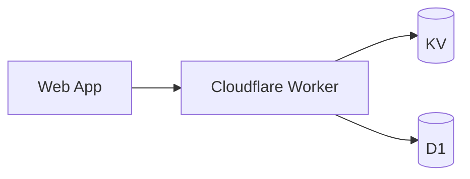

# Architecture

> Copy to ARCHITECTURE.md when the project outgrows its README. Keep diagrams close to reality — stale architecture docs are worse than none.

## Overview

<!-- One paragraph: what the system does, its main moving parts, where it runs. -->

## System Diagram

<!-- Mermaid renders on GitHub: -->

## Components

| Component | Responsibility | Location |
|---|---|---|
| Frontend | | `src/` |
| API / Worker | | `worker/` or `functions/` |
| Data | | KV / D1 / R2 |

## Data Flow

<!-- Trace one representative request end-to-end. -->

## Key Decisions

<!-- Link ADRs: docs/adr/0001-example.md -->

## Testing Strategy

<!-- What's unit vs integration vs e2e; what the validate gate covers. -->

## Deployment

<!-- Environments, wrangler configs, migration story, rollback. -->
